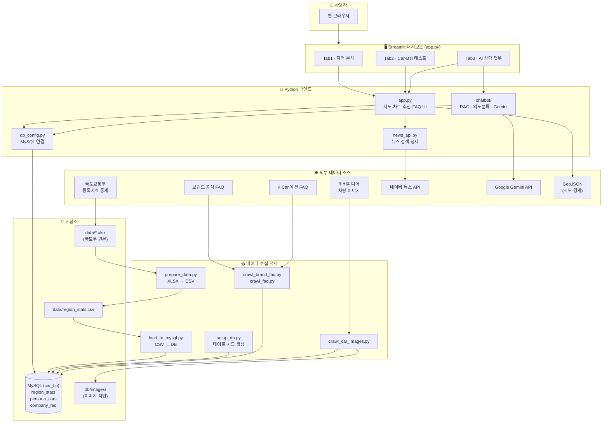
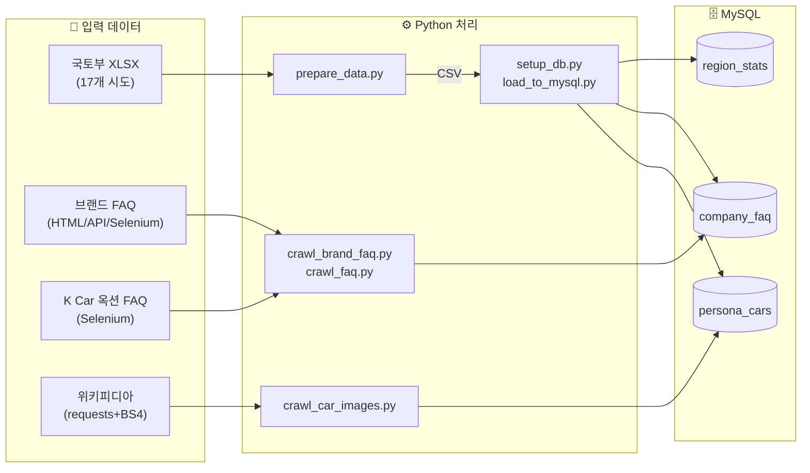
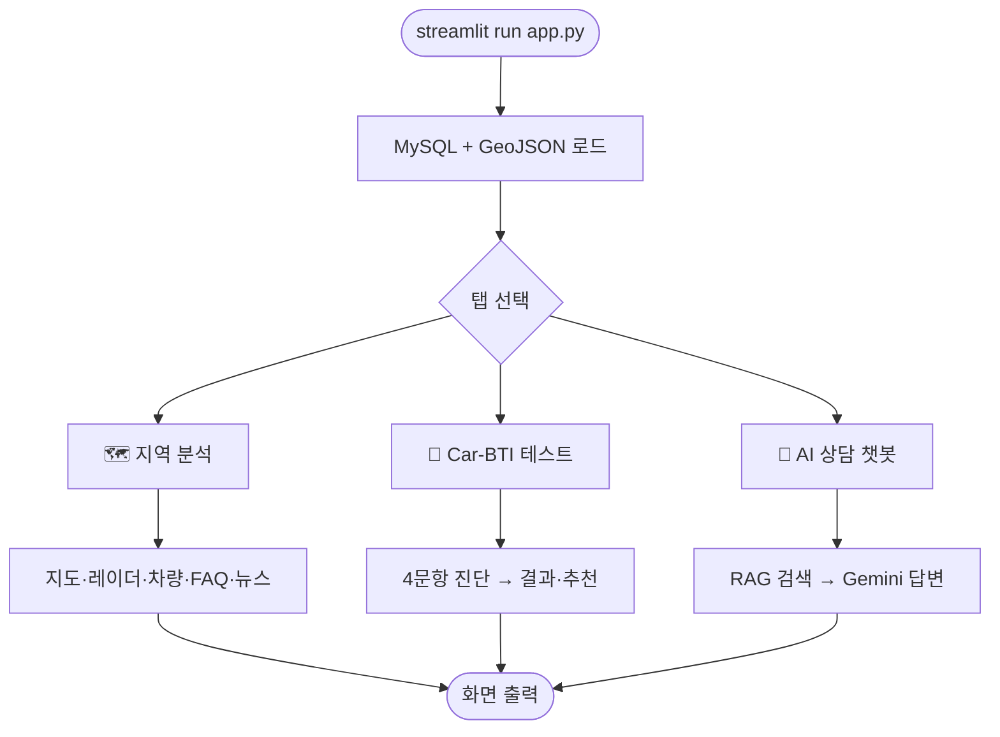
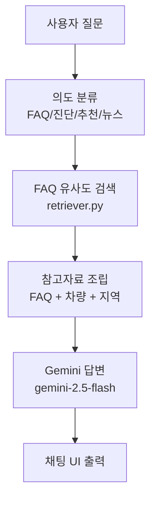
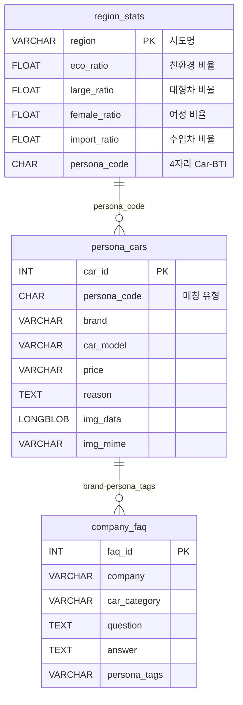

# 🚗 Car-BTI: 전국 자동차 소비 성향 분석 대시보드

**MBTI 스타일 4축 16유형으로 전국 17개 시도의 자동차 등록 현황을 시각화하고, 맞춤형 차량 추천·FAQ·AI 상담을 제공하는 Streamlit 대시보드**

---

## 1. 프로젝트 개요

| 항목 | 내용 |
|------|------|
| **주제** | 전국 자동차 등록 현황 분석 및 기업 FAQ·맞춤 추천 시스템 |
| **목표** | 지역별 Car-BTI(4축 16유형) 시각화 + 사용자 성향 기반 차량·FAQ·뉴스·AI 상담 제공 |
| **데이터 출처** | 국토교통부 2026년 5월 자동차 등록자료 통계, 브랜드 공식 FAQ, K Car 옥션, 위키피디아 |
| **규모** | 지역 17개 시도 · 추천 차량 64대 · FAQ 750+건 |

---

## 2. 개발 배경 및 필요성

- 전국 시·도별 **자동차 등록 패턴**(친환경·차종·성별·수입/국산)을 한눈에 비교할 도구가 필요함
- 단순 통계 표를 넘어 **MBTI형 4자리 코드(Car-BTI)** 로 지역·사용자 성향을 직관적으로 표현
- 차량 구매·유지와 관련된 **브랜드 FAQ**를 크롤링·태깅해 페르소나별로 큐레이션
- **RAG 기반 AI 챗봇**으로 FAQ·차량·지역 데이터를 근거로 한 상담 기능 제공

---

## 3. 주요 기능

### Tab 1 · 🗺️ 지역 분석
- Folium 지도 5모드 (친환경 / 대형 / 여성 / 수입 / 16색 페르소나)
- 선택 지역 4축 레이더 차트 · 페르소나 코드·한 줄 요약
- 페르소나 매칭 차량 4대 · 맞춤 FAQ Top 10 · 최신 뉴스

### Tab 2 · 🧪 나의 Car-BTI 테스트
- 4문항 설문 → 4자리 Car-BTI 산출
- 유사 지역 Top 3 · 추천 차량 · FAQ · 뉴스

### Tab 3 · 💬 AI 상담 챗봇 (RAG)
- FAQ 답변 · 성향 진단 · 차량 추천 · 뉴스를 하나의 챗 창에서 처리
- Google Gemini + `company_faq` 근거 기반 답변 (환각 최소화)
- API 키 미설정 시에도 키워드 검색·추천 **기본 모드** 동작

### 공통
- 네이버 뉴스 API로 추천 브랜드/모델 관련 **실시간 뉴스** 조회 (Streamlit 캐시)

---

## 4. 기술 스택

| 구분 | 기술 |
|------|------|
| **Frontend / UI** | Streamlit, Folium, streamlit-folium, Plotly |
| **Backend** | Python, Pandas |
| **Database** | MySQL, PyMySQL, SQLAlchemy |
| **크롤링** | BeautifulSoup4, Selenium, requests |
| **외부 API** | 네이버 뉴스 검색 API, Google Gemini API |
| **AI** | RAG (임베딩 검색 + LLM), google-genai |

---

## 5. 시스템 아키텍처 (전체 구조)



---

## 6. 기능 흐름도

### 6-1. 데이터 파이프라인 (수집 → 가공 → 적재)



| 데이터 | 스크립트 | 방식 | 저장 테이블 |
|--------|----------|------|-------------|
| 지역 등록 통계 | `prepare_data.py` → `load_to_mysql.py` | XLSX → CSV → MySQL | `region_stats` |
| 브랜드 FAQ | `crawl_brand_faq.py` | requests / API / Selenium | `company_faq` |
| K Car 옥션 FAQ | `crawl_faq.py` | Selenium (탭 클릭) | `company_faq` |
| 차량 이미지 | `crawl_car_images.py` | requests + BeautifulSoup | `persona_cars` |

### 6-2. Streamlit 사용자 흐름



### 6-3. AI 챗봇 RAG 흐름



---

## 7. ERD (데이터베이스 구조)



### Car-BTI 4축 · 임계값

| 축 | A (높을 때) | B (낮을 때) | 임계값 |
|----|-------------|-------------|--------|
| 1 | E 친환경 | G 내연기관 | eco_ratio ≥ 14.0% |
| 2 | L 대형/SUV | S 소형/세단 | large_ratio ≥ 14.8% |
| 3 | F 여성 강세 | M 남성 강세 | female_ratio ≥ 27.5% |
| 4 | I 수입 | D 국산 | import_ratio ≥ 12.0% |

예) 서울 → `ELMI` (친환경·대형·남성·수입)

---

## 10. 화면 구성

| 탭 | 구성 요소 |
|----|-----------|
| **지역 분석** | 지도 5모드 · 페르소나 박스 · 레이더 차트 · 4축 설명 · 통계 progress bar · 추천 차량 4대 · FAQ · 뉴스 |
| **Car-BTI 테스트** | 4문항 radio · 결과 박스 · 유사 지역 Top 3 · 추천 차량 · FAQ · 뉴스 |
| **AI 상담 챗봇** | 채팅 UI · 예시 질문 · AI/기본 모드 배지 · 대화 초기화 |

---

## 11. 프로젝트 구조

```
├── app.py                    # Streamlit 메인 (3탭)
├── prepare_data.py           # XLSX → CSV
├── load_to_mysql.py          # CSV → region_stats
├── setup_db.py               # 테이블·시드 생성
├── db_config.py              # MySQL 연결
├── news_api.py               # 네이버 뉴스 API
├── check_db.py               # DB 점검
├── crawler/                  # FAQ·이미지 크롤러
├── chatbot/                  # AI RAG 챗봇
├── data/                     # 원본 XLSX · CSV
├── docs/                     # WBS · 요구사항정의서 · 아키텍처
└── db/images/                # 이미지 로컬 백업
```

---

## 12. 실행 방법

```bash
# 1. 가상환경 & 패키지
python -m venv myvenv
myvenv\Scripts\activate          # Windows
pip install -r requirements.txt

# 2. 환경 변수 (.env.example 참고)
cp .env.example .env

# 3. 데이터 적재
python prepare_data.py
python setup_db.py
python load_to_mysql.py
python crawler/crawl_brand_faq.py
python crawler/crawl_faq.py
python crawler/crawl_car_images.py
python check_db.py

# 4. 실행
streamlit run app.py
```

브라우저: `http://localhost:8501`

---

## 13. 데이터 출처 및 크롤링

| 구분 | 출처 | 수집 방식 |
|------|------|-----------|
| 지역 통계 | 국토교통부 등록자료 | XLSX → CSV → MySQL |
| 브랜드 FAQ | 제네시스·현대·기아·BMW 등 | HTML / REST API / Selenium |
| K Car 옥션 FAQ | kcarauction.com | Selenium (6탭) |
| 차량 이미지 | 위키피디아 | requests + BeautifulSoup |
| 뉴스 | 네이버 뉴스 검색 API | 실시간 조회 (DB 미저장) |
| AI | Google Gemini | RAG 답변 생성 |

크롤링 불가 브랜드(벤츠·테슬라 등)는 `faq_fallback.py` 시드 FAQ로 대체합니다.

---

## 14. 참고 자료

- [Streamlit](https://docs.streamlit.io/)
- [Folium](https://folium.readthedocs.io/)
- [BeautifulSoup](https://www.crummy.com/software/BeautifulSoup/)
- [Selenium](https://selenium-python.readthedocs.io/)
- [네이버 뉴스 검색 API](https://developers.naver.com/docs/serviceapi/search/news/news.md)
- [Google AI Studio (Gemini API)](https://aistudio.google.com/app/apikey)

### 관련 문서 (`docs/`)

| 파일 | 설명 |
|------|------|
| `docs/WBS.csv` | 작업 분해 구조 |
| `docs/요구사항정의서.csv` | 요구사항 정의 |
| `docs/아키텍처_기능흐름도.md` | 상세 아키텍처·흐름도 |

Last Updated: 2026-07-02 09:45