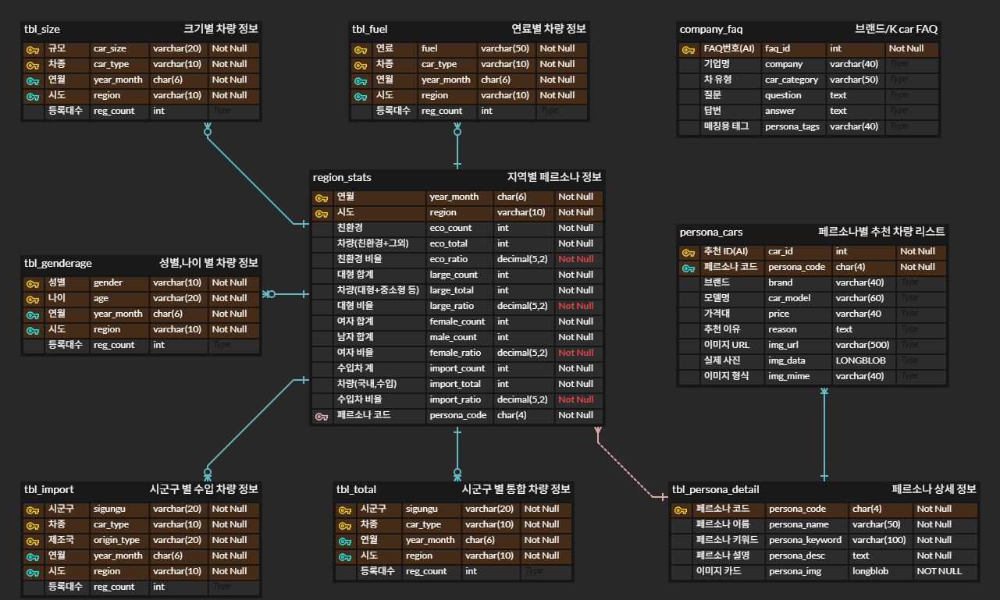

# 🚗 Car-BTI: 전국 자동차 소비 성향 분석 대시보드
**MBTI-style로 전국 자동차 등록 현황을 시각화하고, 맞춤형 차량 추천·뉴스·FAQ·AI 챗봇을 제공하는 대시보드**

<br>

## 👥 팀 소개

**SKN34기 3팀**

| 이름 | 역할 | GitHub |
|------|-----------|--------|
| 노민환 | 팀장 / 프로토타입 제작 / 데이터 정제 / 뉴스 API 연동 / Streamlit GUI 설계 | [](https://github.com/minhwan123) |
| 김대호 |  | [](https://github.com/jjhok6389) |
| 이홍규 |  | [](https://github.com/4hglee-ops) |
| 전진영 |  | [](https://github.com/msi67811-jpg) |

<br>

## 📌 프로젝트 개요

### 💡 필요성

지역별 자동차 소비 특성을 직관적으로 분석하고, 데이터 기반의 맞춤형 차량 정보와 자동차 관련 서비스를 제공하기 위해 개발되었습니다.

### 🎯 목표

- 자동차 등록 데이터 ETL 및 MySQL 구축
- Car-BTI 유형 생성 및 시각화
- 개인 Car-BTI 진단과 맞춤형 차량·FAQ·뉴스 제공
- OpenAI 기반 AI 상담 챗봇 구현

<br>

## 🛠️ 기술 스택

### Language & Framework


### Database


### Crawling


### Data & Visualization


### AI & API


### Tools


<br>

## 📅 WBS & 개발 일정

| 구분 | 작업 | 6/27 | 6/28 | 6/29 | 6/30 | 7/1 | 7/2 |
|------|------|:----:|:----:|:----:|:----:|:---:|:---:|
| 📋 **기획 및 설계** | 주제 선정 / 데이터 탐색 | 🟦 | ⬜ | ⬜ | ⬜ | ⬜ | ⬜ |
| | ERD 작성 / WBS 작성 | 🟦 | ⬜ | ⬜ | ⬜ | ⬜ | ⬜ |
| | Git 브랜치 전략 / 디자인 컨셉 | 🟦 | ⬜ | ⬜ | ⬜ | ⬜ | ⬜ |
| | 디렉터리 구조 / 프로젝트 생성 | 🟦 | ⬜ | ⬜ | ⬜ | ⬜ | ⬜ |
| 🗄️ **DB 구축** | MySQL DB / 테이블 생성 | ⬜ | 🟦 | ⬜ | ⬜ | ⬜ | ⬜ |
| | 크롤링 데이터 연동 | ⬜ | 🟦 | 🟦 | ⬜ | ⬜ | ⬜ |
| | API 데이터 연동 | ⬜ | 🟦 | 🟦 | ⬜ | ⬜ | ⬜ |
| 📊 **데이터 처리** | XLSX → CSV 변환 / 페르소나 코드 산출 | ⬜ | 🟦 | ⬜ | ⬜ | ⬜ | ⬜ |
| | CSV → MySQL 적재 | ⬜ | 🟦 | ⬜ | ⬜ | ⬜ | ⬜ |
| 🕷️ **웹 크롤링** | 브랜드 공식 FAQ 크롤링 | ⬜ | ⬜ | 🟦 | ⬜ | ⬜ | ⬜ |
| | K Car 옥션 FAQ 크롤링 | ⬜ | ⬜ | 🟦 | ⬜ | ⬜ | ⬜ |
| | 차량 이미지 크롤링 | ⬜ | ⬜ | 🟦 | ⬜ | ⬜ | ⬜ |
| | Fallback 시드 구성 | ⬜ | ⬜ | 🟦 | ⬜ | ⬜ | ⬜ |
| 🔌 **API 연동** | 네이버 뉴스 API 발급 / 호출 정제 | ⬜ | ⬜ | 🟦 | ⬜ | ⬜ | ⬜ |
| | 지도 GeoJSON API 연동 | ⬜ | ⬜ | 🟦 | ⬜ | ⬜ | ⬜ |
| | OpenAI API KEY 발급 | ⬜ | ⬜ | 🟦 | ⬜ | ⬜ | ⬜ |
| 🖥️ **Streamlit 구현** | 메인 페이지 / 헤더 구현 | ⬜ | ⬜ | ⬜ | 🟦 | ⬜ | ⬜ |
| | 지역 분석 페이지 구현 | ⬜ | ⬜ | ⬜ | 🟦 | 🟦 | ⬜ |
| | 페르소나 차량 / FAQ 구현 | ⬜ | ⬜ | ⬜ | ⬜ | 🟦 | ⬜ |
| | Car-BTI 테스트 페이지 구현 | ⬜ | ⬜ | ⬜ | ⬜ | 🟦 | ⬜ |
| | 추천 차량 뉴스 섹션 구현 | ⬜ | ⬜ | ⬜ | ⬜ | 🟦 | ⬜ |
| 🤖 **AI 상담 챗봇** | LLM / 임베딩 연동 | ⬜ | ⬜ | ⬜ | ⬜ | ⬜ | 🟦 |
| | FAQ RAG 검색 구현 | ⬜ | ⬜ | ⬜ | ⬜ | ⬜ | 🟦 |
| | 의도 분류 / 답변 생성 | ⬜ | ⬜ | ⬜ | ⬜ | ⬜ | 🟦 |
| | AI 챗봇 페이지 구현 | ⬜ | ⬜ | ⬜ | ⬜ | ⬜ | 🟦 |
| ✅ **테스트 및 마무리** | DB 적재 점검 | ⬜ | ⬜ | ⬜ | ⬜ | ⬜ | 🟦 |
| | README / 문서화 | ⬜ | ⬜ | ⬜ | ⬜ | ⬜ | 🟦 |

<br>

## 📁 프로젝트 구조

```
SKN34-1st-3Team/
├── app.py                      # Streamlit 메인 대시보드 (3탭 UI)
├── region_ETL.py               # 국토부 xlsx → 4축 비율 계산 → CSV 저장
├── setup_db.py                 # DB 테이블 생성 + persona_cars 시드 데이터 적재
├── db_config.py                # MySQL 연결 헬퍼 (env / secrets / 기본값 우선순위)
├── check_db.py                 # DB 적재 상태 점검 스크립트
├── news_api.py                 # 네이버 뉴스 API 호출 및 정제
├── requirements.txt            # 의존 패키지 목록
├── .env.example                # 환경변수 템플릿
│
├── chatbot/                    # AI 상담 챗봇 패키지
│   ├── __init__.py             # 패키지 진입점 (ChatContext, answer, render_chatbot)
│   ├── intents.py              # 의도 분류 · 엔티티 추출 · 답변 오케스트레이터
│   ├── retriever.py            # FAQ 검색 (키워드 기본 / OpenAI 임베딩 선택)
│   ├── llm_client.py           # OpenAI Chat API 클라이언트 (스로틀 · 재시도)
│   ├── prompts.py              # intent별 시스템 프롬프트
│   ├── scope.py                # 답변 가능 범위 판별
│   └── ui.py                   # Streamlit 채팅 UI
│
├── crawler/                    # 웹 크롤링 패키지
│   ├── crawl_brand_faq.py      # 브랜드 공식 FAQ 크롤링 (현대·기아·제네시스·BMW 등)
│   ├── crawl_faq.py            # K Car 옥션 FAQ 크롤링 (Selenium)
│   ├── crawl_car_images.py     # 위키피디아 차량 이미지 크롤링 → DB 적재
│   ├── faq_common.py           # 크롤러 공통 유틸 (태깅·카테고리·정제)
│   └── faq_fallback.py         # 크롤링 불가 브랜드용 시드 FAQ
│
├── data/
│   └── 2026년_05월_자동차_등록자료_통계.xlsx   # 국토부 원본 데이터
│
├── ETL_data/
│   └── region_stats.csv        # region_ETL.py 산출물 (17개 시도 × 4축 비율)
│
└── docs/
    ├── 아키텍처_기능흐름도.md
    ├── WBS.csv
    └── 요구사항정의서.csv
```

<br>

## 🗂️ ERD (Entity Relationship Diagram)



<br>

## ⚙️ 실행 가이드

### 1단계 — 저장소 클론

```bash
git clone https://github.com/SKNETWORKS-FAMILY-AICAMP/SKN34-1st-3Team.git
cd SKN34-1st-3Team
```

<br>

### 2단계 — 가상환경 생성 및 활성화

**Windows**
```bash
python -m venv venv
venv\Scripts\activate
```

**macOS / Linux**
```bash
python3 -m venv venv
source venv/bin/activate
```

<br>

### 3단계 — 패키지 설치

```bash
pip install -r requirements.txt
```

<br>

### 4단계 — 환경변수 설정

`.env.example`을 복사해 `.env` 파일을 생성하고 값을 채웁니다.

```bash
cp .env.example .env   # macOS / Linux
copy .env.example .env  # Windows
```

`.env` 파일 내용:

```env
# MySQL 접속 정보
MYSQL_HOST=localhost
MYSQL_PORT=3306
MYSQL_USER=root
MYSQL_PASSWORD=your_password
MYSQL_DATABASE=car_bti

# 네이버 뉴스 API (https://developers.naver.com)
NAVER_CLIENT_ID=your_naver_client_id
NAVER_CLIENT_SECRET=your_naver_client_secret

# OpenAI API (https://platform.openai.com)
OPENAI_API_KEY=your_openai_api_key
OPENAI_CHAT_MODEL=gpt-4o-mini
```

> **API 키 발급 안내**
> - 네이버 뉴스 API: [네이버 개발자 센터](https://developers.naver.com/apps/#/register) → 애플리케이션 등록 → 검색 API 선택
> - OpenAI API: [OpenAI Platform](https://platform.openai.com/api-keys) → API Keys → Create new secret key
> - `OPENAI_API_KEY` 없이도 실행 가능하며, 미설정 시 챗봇은 규칙 기반 모드로 동작합니다.

<br>

### 5단계 — DB 초기화 및 데이터 적재

아래 순서대로 실행합니다.

```bash
# ① 테이블 생성 + persona_cars 시드 데이터 (64건) 적재
python setup_db.py

# ② 브랜드 공식 FAQ 크롤링 → DB 적재 (현대·기아·제네시스·BMW 등)
python crawler/crawl_brand_faq.py

# ③ K Car 옥션 FAQ 크롤링 → DB 적재 (Selenium 필요)
python crawler/crawl_faq.py

# ④ 차량 이미지 크롤링 → DB 적재 (위키피디아)
python crawler/crawl_car_images.py

# ⑤ DB 적재 상태 점검 (선택)
python check_db.py
```

<br>

### 6단계 — 대시보드 실행

```bash
streamlit run app.py
```

브라우저에서 `http://localhost:8501` 로 접속합니다.

<br>

## 💬 한 줄 회고

> **노민환** : python, mysql을 기반으로 다양한 기능을 구현하며 서비스를 확장하는 경험은 유의미했지만, 앞으로는 기능을 늘리기보다 핵심 기능을 깊이 있게 완성하는 프로젝트를 해보고 싶다는 생각이 들었습니다.
>
> **김대호** :
>
> **이홍규** :
>
> **전진영** :

