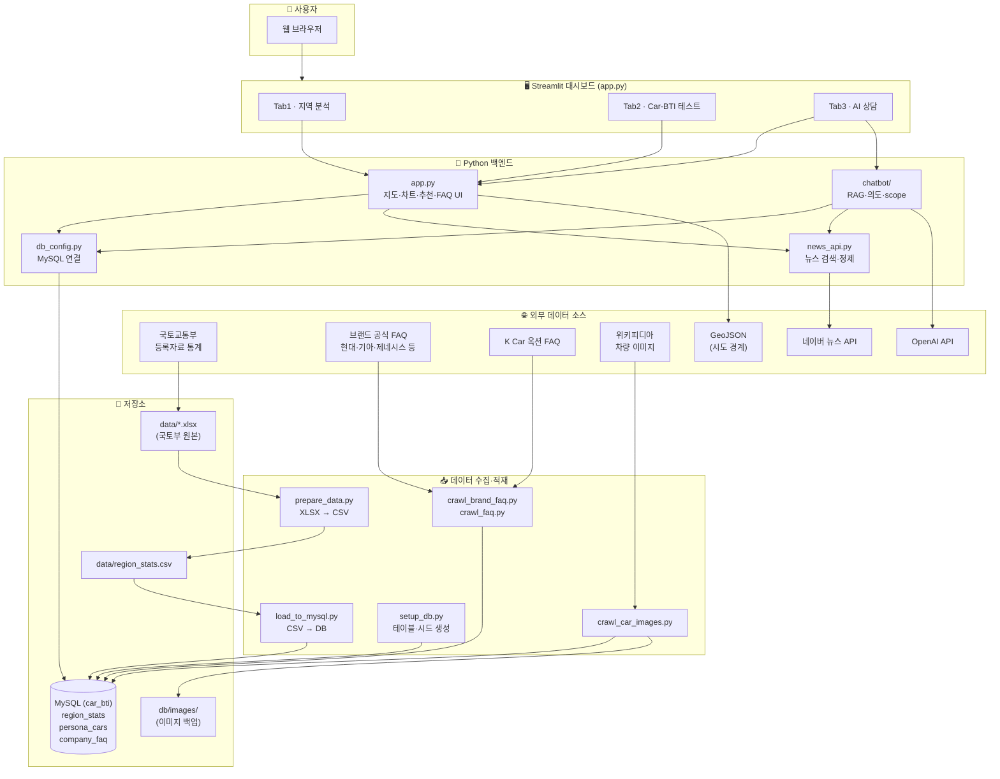
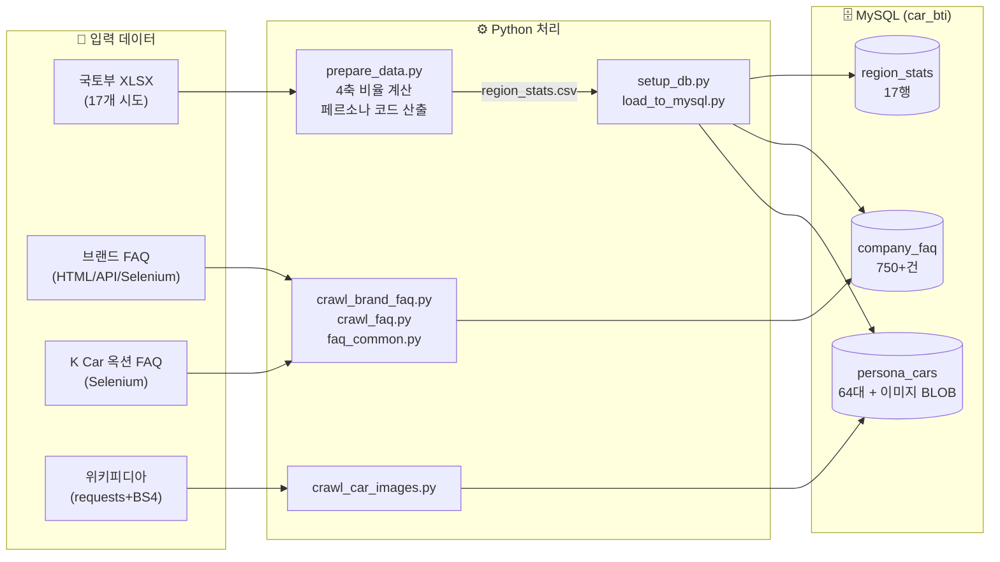
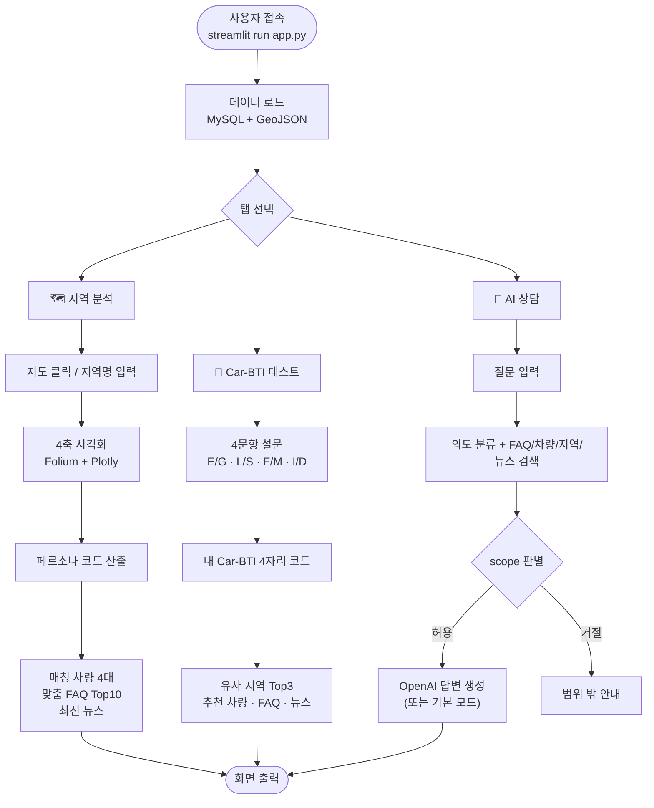
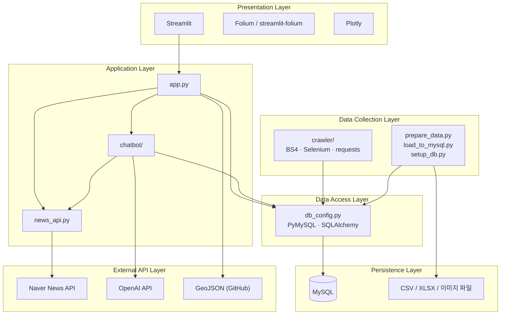
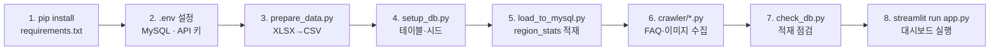
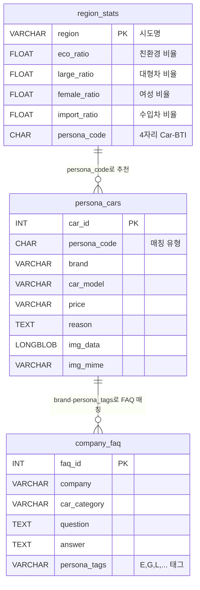

# Car-BTI 시스템 아키텍처 & 기능 흐름도

> **전국 Car-BTI 대시보드** — Streamlit · Python · MySQL · 크롤링 · 외부 API  
> 발표·문서용으로 시스템 전체 구조를 한눈에 볼 수 있도록 정리한 자료입니다.

---

## 1. 시스템 아키텍처 (전체 구조)

---

## 2. 데이터 파이프라인 흐름 (수집 → 가공 → 적재)

### 데이터 소스별 수집 방식

| 데이터 | 스크립트 | 방식 | 저장 테이블 |
|--------|----------|------|-------------|
| 지역 등록 통계 | `prepare_data.py` → `load_to_mysql.py` | XLSX → CSV → MySQL | `region_stats` |
| 브랜드 FAQ | `crawl_brand_faq.py` | requests / API / Selenium | `company_faq` |
| K Car 옥션 FAQ | `crawl_faq.py` | Selenium (탭 클릭) | `company_faq` |
| 차량 이미지 | `crawl_car_images.py` | requests + BeautifulSoup | `persona_cars` (LONGBLOB) |
| 차량·FAQ 시드 | `setup_db.py` | 초기 INSERT | `persona_cars`, `company_faq` |

---

## 3. Streamlit 기능 흐름 (사용자 관점)

---

## 4. 기술 스택 레이어

---

## 5. 실행 순서 (로컬 개발·데모)

---

## 6. ERD (데이터베이스 관계 요약)

---

## 7. 발표용 한 줄 설명 (스크립트)

> **"Car-BTI는 국토부 등록 통계와 브랜드 FAQ를 MySQL에 모은 뒤, Streamlit으로 지역·성향·차량을 시각화하고 맞춤 추천·뉴스까지 제공하는 통합 대시보드입니다."**

---

## 부록: 주요 파일 역할

| 구분 | 파일 | 역할 |
|------|------|------|
| UI | `app.py` | Streamlit 메인 (3탭) |
| AI | `chatbot/` | RAG 챗봇 (의도·scope·OpenAI) |
| DB | `db_config.py` | MySQL 연결 |
| DB | `setup_db.py` | 테이블·시드 생성 |
| ETL | `prepare_data.py` | 국토부 XLSX → CSV |
| ETL | `load_to_mysql.py` | CSV → region_stats |
| 크롤링 | `crawler/crawl_brand_faq.py` | 브랜드 FAQ |
| 크롤링 | `crawler/crawl_faq.py` | K Car 옥션 FAQ |
| 크롤링 | `crawler/crawl_car_images.py` | 차량 이미지 |
| API | `news_api.py` | 네이버 뉴스 |

> **Tab 3 AI 상담:** `OPENAI_API_KEY` 설정 시 AI 모드, 미설정 시 FAQ·차량·뉴스 규칙 기반 기본 모드로 동작합니다.

---

*Last Updated: 2026-07-02*
